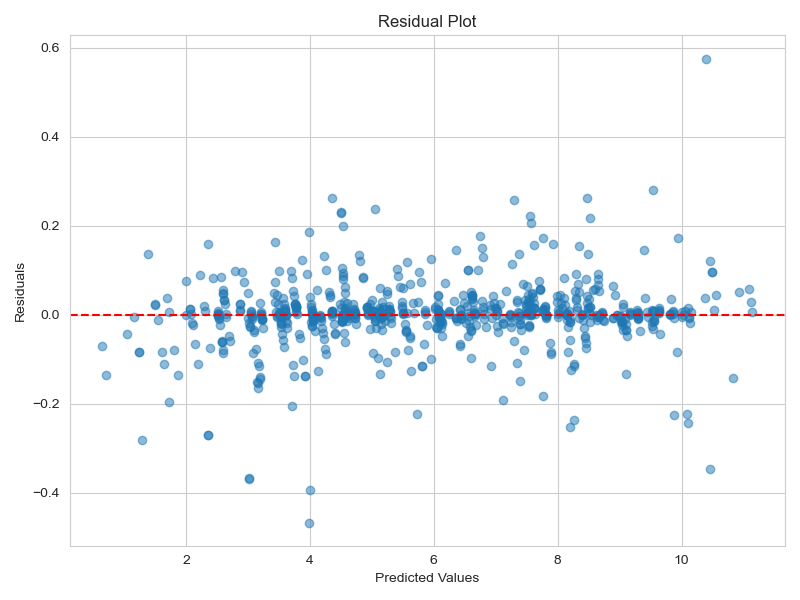
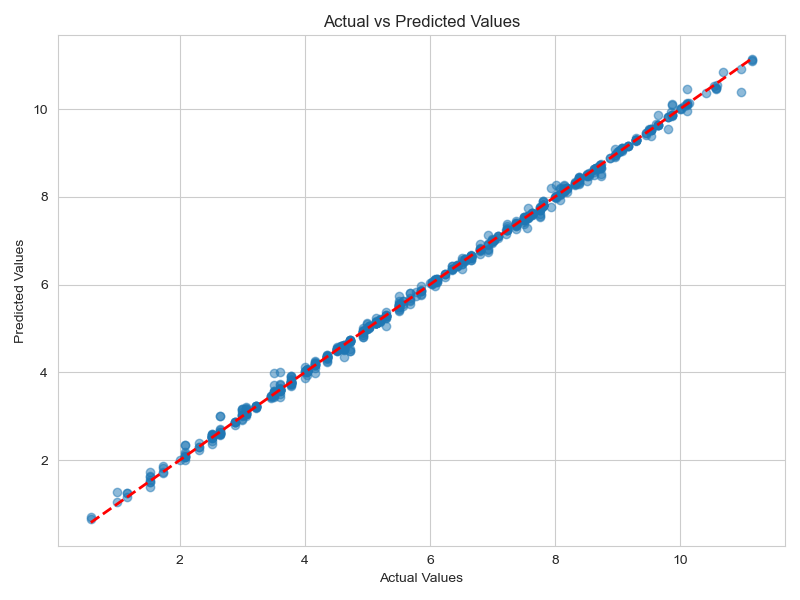
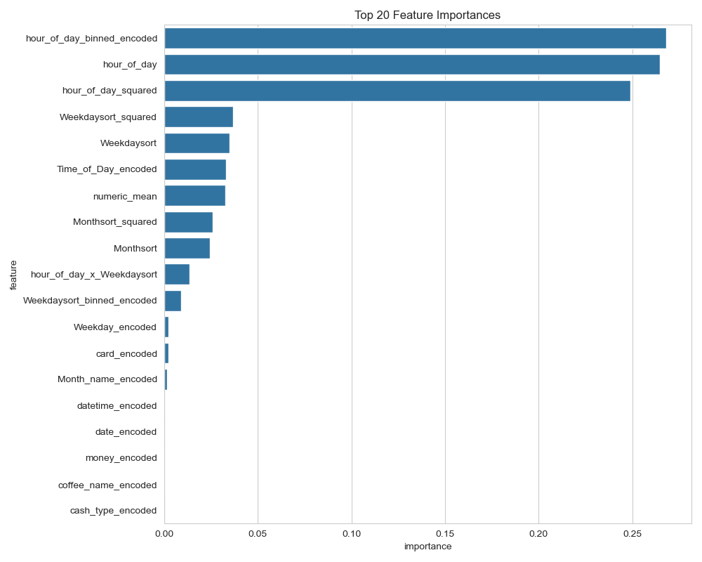

# Model Evaluation Report

## Model Overview
- **Model Type:** RandomForestRegressor
- **Problem Type:** Regression
- **Test Set Size:** 728 samples
- **Number of Features:** 19

## Performance Metrics

| Metric | Score |
|--------|-------|
| MSE | 0.0058 |
| RMSE | 0.0764 |
| MAE | 0.0428 |
| R² | 0.9989 |

## Residual Plot

## Actual vs Predicted

## Feature Importance

### Top 10 Most Important Features

- **hour_of_day_binned_encoded**: 0.2683
- **hour_of_day**: 0.2646
- **hour_of_day_squared**: 0.2491
- **Weekdaysort_squared**: 0.0368
- **Weekdaysort**: 0.0349
- **Time_of_Day_encoded**: 0.0330
- **numeric_mean**: 0.0327
- **Monthsort_squared**: 0.0259
- **Monthsort**: 0.0244
- **hour_of_day_x_Weekdaysort**: 0.0136

## Recommendations

1. Review misclassified samples to understand model limitations
2. Consider ensemble methods if performance needs improvement
3. Monitor model performance on production data
4. Retrain periodically with new data

## Next Steps

1. Deploy model to production environment
2. Set up monitoring and alerting
3. Collect feedback for model iteration
4. Plan for model versioning and updates
