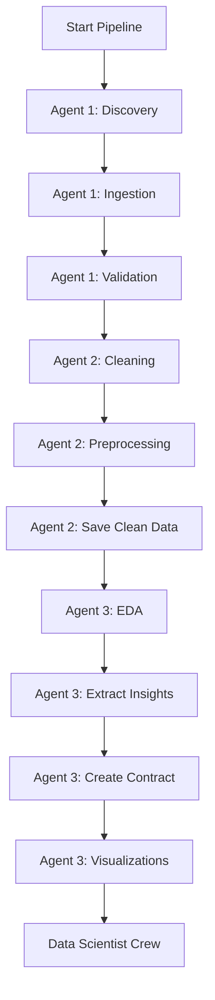

# Multi-Agent ML Pipeline - Complete Documentation

## Overview

This project implements a **multi-crew ML pipeline** with **6 specialized agents** across **2 crews**, executing **19 tasks** to deliver a complete machine learning solution from raw data to production-ready models.

---

## Pipeline Architecture

```
┌──────────────────────────────────────────────────────┐
│         CREW 1: DATA ANALYST CREW                    │
│         (3 Agents, 10 Tasks)                         │
│                                                      │
│   Agent 1: Data Ingestion Specialist (3 tasks)     │
│   Agent 2: Data Cleaning Engineer (3 tasks)        │
│   Agent 3: Analytics & Insights Specialist (4 tasks)│
│                                                      │
│   Output: clean_data.csv + dataset_contract.json   │
└──────────────────────────────────────────────────────┘
                         ↓
┌──────────────────────────────────────────────────────┐
│         CREW 2: DATA SCIENTIST CREW                  │
│         (3 Agents, 9 Tasks)                          │
│                                                      │
│   Agent 1: Feature Engineering Specialist (3 tasks) │
│   Agent 2: Model Training Specialist (3 tasks)      │
│   Agent 3: Model Evaluator & Doc Specialist (3 tasks)│
│                                                      │
│   Output: features.csv + model.pkl + reports        │
└──────────────────────────────────────────────────────┘
```

---

## 🤖 Crew 1: Data Analyst Crew (3 Agents, 10 Tasks)

### Architecture

```
┌─────────────────────────────────────────────────────────┐
│              DATA ANALYST CREW WORKFLOW                 │
├─────────────────────────────────────────────────────────┤
│                                                         │
│  Agent 1: Data Ingestion Specialist (3 tasks)         │
│    ├─ Task 1: Dataset Discovery & Selection           │
│    ├─ Task 2: Dataset Ingestion                       │
│    └─ Task 3: Initial Validation                      │
│              ↓                                         │
│  Agent 2: Data Cleaning Engineer (3 tasks)            │
│    ├─ Task 4: Data Cleaning                           │
│    ├─ Task 5: Data Preprocessing                      │
│    └─ Task 6: Save Clean Data                         │
│              ↓                                         │
│  Agent 3: Analytics & Insights Specialist (4 tasks)   │
│    ├─ Task 7: Exploratory Data Analysis               │
│    ├─ Task 8: Extract Business Insights               │
│    ├─ Task 9: Create Dataset Contract                 │
│    └─ Task 10: Generate Visualizations                │
│                                                         │
└─────────────────────────────────────────────────────────┘
```

---

## Agent 1: Data Ingestion & Validation Specialist

### Role
**Data Ingestion & Validation Specialist**

### Goal
Locate, download, and validate high-quality datasets from public sources (Kaggle or Open Data APIs)

### Backstory
Expert in discovering and validating data sources with extensive experience working with Kaggle datasets and Open Data APIs. Has a keen eye for data quality assessment and can quickly identify datasets that meet project requirements.

### Tasks

#### Task 1: Dataset Discovery & Selection
**Objective:** Search for and select a suitable dataset

**Requirements:**
- Dataset must have ≥1000 rows and ≥5 columns
- Assess data quality, relevance, and completeness
- Focus on retail, e-commerce, sales, or customer behavior
- Document source, licensing, and selection rationale

**Output:**
- `artifacts/dataset_selection_report.md`

**Deliverables:**
- Dataset name and source URL
- Dataset dimensions (rows × columns)
- Brief description
- Selection rationale
- Potential use cases

---

#### Task 2: Dataset Ingestion
**Objective:** Download and load the selected dataset

**Steps:**
1. Download dataset from selected source
2. Place raw data in `data/raw/Coffe_sales.csv`
3. Load data into pandas DataFrame
4. Verify file integrity and encoding
5. Perform initial inspection (head, info, describe)

**Handles:**
- Large file sizes (sampling if >100MB)
- Encoding issues (convert to UTF-8)
- Compressed formats (zip, gz, etc.)

**Output:**
- `data/raw/Coffe_sales.csv`
- `artifacts/raw_data_profile.txt`

---

#### Task 3: Initial Validation
**Objective:** Comprehensive validation of ingested raw data

**Validation Checks:**

1. **Schema Validation**
   - Verify expected columns
   - Check data types
   - Identify naming issues

2. **Data Quality Assessment**
   - Missing value percentages per column
   - Identify duplicate rows
   - Detect null or empty strings
   - Check placeholder values (-999, 'N/A', 'Unknown')

3. **Basic Statistics**
   - Numerical: min, max, mean, median, std
   - Categorical: unique values, value counts
   - Date: date ranges, gaps

4. **Anomaly Detection**
   - Outliers (IQR method)
   - Unusual distributions
   - Constant or near-constant columns

**Output:**
- `artifacts/validation_report.md`

---

## Agent 2: Data Cleaning & Preprocessing Engineer

### Role
**Data Cleaning & Preprocessing Engineer**

### Goal
Transform raw data into clean, analytics-ready format through comprehensive preprocessing

### Backstory
Veteran data engineer specializing in advanced data cleaning and preprocessing techniques. Deep expertise in handling missing values, outliers, duplicates, and inconsistencies. Meticulous documentation ensures complete traceability.

### Tasks

#### Task 4: Data Cleaning
**Objective:** Perform comprehensive data cleaning

**Cleaning Operations:**

1. **Missing Values Handling**
   - Numeric: Impute with median/mean/mode
   - Categorical: Mode or 'Unknown' category
   - Drop columns with >70% missing values
   - Document all imputation strategies

2. **Duplicate Removal**
   - Exact duplicates
   - Near-duplicates (fuzzy matching)
   - Document removal counts

3. **Outlier Treatment**
   - IQR method or Z-score detection
   - Winsorization or removal
   - Document handling strategy

4. **Data Consistency**
   - Standardize categorical values
   - Trim whitespace, fix capitalization
   - Handle special characters

5. **Data Type Corrections**
   - Convert numeric strings to numbers
   - Parse dates to datetime
   - Convert codes to labels

**Output:**
- `artifacts/cleaning_log.md`

---

#### Task 5: Data Preprocessing
**Objective:** Apply preprocessing transformations

**Preprocessing Steps:**

1. **Categorical Encoding**
   - Label Encoding (ordinal)
   - One-Hot Encoding (nominal, <10 categories)
   - Frequency Encoding (high-cardinality)

2. **Numerical Feature Scaling**
   - Standardization (Z-score)
   - Min-Max scaling
   - Log transformation (skewed distributions)

3. **Feature Engineering (Basic)**
   - Extract date components (year, month, day, weekday)
   - Derived features (e.g., total = quantity × price)
   - Binning continuous variables
   - Interaction features

4. **Data Validation**
   - No missing values remain
   - Data types correct
   - Value ranges sensible
   - Referential integrity

**Output:**
- `artifacts/data_dictionary.json`

---

#### Task 6: Save Clean Data
**Objective:** Finalize and save cleaned dataset

**Final Steps:**

1. **Data Quality Verification**
   - Run final validation checks
   - Ensure integrity constraints
   - Verify acceptable data loss range
   - Check for remaining issues

2. **Save Cleaned Dataset**
   - Save to `data/interim/clean_data.csv`
   - UTF-8 encoding
   - Proper CSV formatting
   - Verify readability

3. **Generate Summary Statistics**
   - Before/After comparison
   - Rows processed vs kept
   - Columns processed vs kept
   - Data quality score (completeness %)

4. **Documentation**
   - List all columns with descriptions
   - Transformation pipeline
   - Limitations/caveats
   - Usage recommendations

**Output:**
- `data/interim/clean_data.csv`
- `artifacts/preprocessing_summary.md`

---

## Agent 3: Analytics & Business Insights Specialist

### Role
**Analytics & Business Insights Specialist**

### Goal
Extract actionable business insights and define clear data contracts for downstream teams

### Backstory
Seasoned Business Intelligence analyst with strong background in data storytelling and visualization. Excels at EDA, identifying patterns, trends, and anomalies. Unique ability to translate complex statistical findings into actionable business recommendations.

### Tasks

#### Task 7: Exploratory Data Analysis
**Objective:** Comprehensive EDA on cleaned dataset

**EDA Components:**

1. **Descriptive Statistics**
   - Summary statistics for numerical variables
   - Frequency distributions for categorical
   - Percentile analysis (25th, 50th, 75th, 90th, 95th, 99th)
   - Variance, skewness, kurtosis

2. **Distribution Analysis**
   - Histograms for numerical features
   - Bar charts for categorical features
   - Box plots for outliers
   - Density plots
   - Q-Q plots for normality

3. **Correlation Analysis**
   - Correlation heatmap
   - Identify highly correlated features (r > 0.8)
   - Scatter plots
   - Point-biserial correlations

4. **Categorical Analysis**
   - Pie charts
   - Stacked bar charts
   - Chi-square tests

5. **Time Series Analysis** (if applicable)
   - Trend analysis
   - Seasonality detection
   - Moving averages

6. **Pattern & Anomaly Detection**
   - Unusual patterns
   - Data quality issues
   - Interesting segments

**Libraries:** matplotlib, seaborn, plotly, ydata-profiling

**Output:**
- `artifacts/eda_report.html` (interactive)

---

#### Task 8: Extract Business Insights
**Objective:** Extract actionable business insights

**Insight Categories:**

1. **Key Findings**
   - Most important patterns
   - Significant correlations
   - Unexpected observations
   - Data limitations

2. **Business Implications**
   - Relation to business objectives
   - Impact on decision-making
   - Opportunities identified
   - Risks/concerns

3. **Feature Importance**
   - Most predictive features
   - Features with business value
   - Features needing engineering

4. **Recommendations**
   - Data-driven recommendations
   - Suggested next steps
   - Features to focus/exclude
   - Additional valuable data

5. **Data Storytelling**
   - Narrative connecting data to business value
   - Clear, non-technical language
   - Evidence-based claims
   - Actionable recommendations

**Output:**
- `artifacts/insights.md`

---

#### Task 9: Create Dataset Contract
**Objective:** Formal dataset contract for Data Scientist crew

**Contract Components:**

1. **Schema Definition**
   - Column names (exact strings)
   - Data types (int, float, str, datetime, bool, category)
   - Nullable (null values allowed?)
   - Description (business meaning)

2. **Constraints & Validation Rules**
   - Value ranges (min/max, allowed values)
   - Regular expressions (email, phone patterns)
   - Referential integrity rules
   - Business rules (e.g., end_date ≥ start_date)

3. **Data Quality Metrics**
   - Expected completeness % per column
   - Expected distribution characteristics
   - Acceptable outlier %
   - Data freshness requirements

4. **Assumptions & Caveats**
   - Known data limitations
   - Assumptions made during cleaning
   - Potential biases
   - Recommended use cases

5. **Usage Guidelines**
   - How to load and validate
   - Required preprocessing steps
   - Recommended train/test split
   - Features suitable for modeling

6. **Metadata**
   - Contract version
   - Creation date
   - Dataset version
   - Contact information

**Format:** JSON (JSON Schema standard)

**Output:**
- `artifacts/dataset_contract.json`

---

#### Task 10: Generate Visualizations
**Objective:** Create publication-quality visualizations

**Visualization Categories:**

1. **Distribution Visualizations**
   - Histograms with KDE overlays
   - Bar charts for categorical
   - Box plots grouped by categories
   - Violin plots

2. **Relationship Visualizations**
   - Correlation heatmap (annotated)
   - Scatter plots with trend lines
   - Pair plots
   - Bubble charts (3-variable)

3. **Categorical Visualizations**
   - Stacked/grouped bar charts
   - Pie/donut charts with percentages
   - Tree maps (hierarchical)
   - Count plots (sorted by frequency)

4. **Time Series Visualizations** (if applicable)
   - Line plots with confidence intervals
   - Area charts (cumulative trends)
   - Seasonal decomposition

5. **Advanced Visualizations**
   - Parallel coordinates (multivariate)
   - Radar charts (multi-dimensional)
   - Sankey diagrams (flow analysis)
   - Geographic maps (if location data)

**Design Principles:**
- Consistent color schemes
- Clear titles and axis labels
- Legends where appropriate
- Accessibility (color-blind friendly)
- Screen and print optimization

**Output:**
- `artifacts/visualizations/` (PNG files)
- `artifacts/visualizations/index.md`

---

## Required Outputs Summary

### Data Analyst Crew Outputs

| Output File | Description | Agent |
|------------|-------------|-------|
| `artifacts/dataset_selection_report.md` | Dataset selection documentation | Agent 1 |
| `data/raw/Coffe_sales.csv` | Raw dataset | Agent 1 |
| `artifacts/raw_data_profile.txt` | Initial data profile | Agent 1 |
| `artifacts/validation_report.md` | Data quality validation report | Agent 1 |
| `artifacts/cleaning_log.md` | Cleaning operations log | Agent 2 |
| `artifacts/data_dictionary.json` | Column metadata | Agent 2 |
| `artifacts/preprocessing_summary.md` | Preprocessing documentation | Agent 2 |
| `data/interim/clean_data.csv` | **✓ Required: Clean dataset** | Agent 2 |
| `artifacts/eda_report.html` | **✓ Required: EDA report** | Agent 3 |
| `artifacts/insights.md` | **✓ Required: Business insights** | Agent 3 |
| `artifacts/dataset_contract.json` | **✓ Required: Dataset contract** | Agent 3 |
| `artifacts/visualizations/` | Visualization images | Agent 3 |

**✓ = Official required outputs**

---

## Usage Instructions

### 1. Install Dependencies

```bash
cd retail_ai_final_project
pip install -r requirements.txt
```

### 2. Configure Kaggle API (Optional)

```bash
# Download kaggle.json from https://www.kaggle.com/account
mkdir -p ~/.kaggle
mv kaggle.json ~/.kaggle/
chmod 600 ~/.kaggle/kaggle.json
```

### 3. Run the Data Analyst Crew

```bash
# Full pipeline
python crew/crew_flow.py

# Or via Streamlit
streamlit run app/streamlit_app.py
```

### 4. Access Outputs

All outputs will be generated in:
- `data/interim/clean_data.csv` - Clean dataset
- `artifacts/` - All reports, contracts, and visualizations

---

## Tools & Utilities

### Kaggle Dataset Downloader

```python
from src.utils.kaggle_downloader import KaggleDownloader

# Initialize
downloader = KaggleDownloader()

# Search datasets
datasets = downloader.search_datasets("retail")

# Download dataset
downloader.download_dataset("carrie1/ecommerce-data")

# Get recommendations
downloader.recommend_datasets("retail")
```

---

## Workflow Process



---

## 🤖 Crew 2: Data Scientist Crew (3 Agents, 9 Tasks)

### Architecture

```
┌─────────────────────────────────────────────────────────┐
│          DATA SCIENTIST CREW WORKFLOW                   │
├─────────────────────────────────────────────────────────┤
│                                                         │
│  Agent 1: Feature Engineering Specialist (3 tasks)     │
│    ├─ Task 1: Validate Dataset & Contract              │
│    ├─ Task 2: Perform Feature Engineering              │
│    └─ Task 3: Prepare Train/Test Split                 │
│              ↓                                         │
│  Agent 2: Model Training Specialist (3 tasks)          │
│    ├─ Task 4: Train Baseline Models                    │
│    ├─ Task 5: Optimize Best Models                     │
│    └─ Task 6: Validate Final Model                     │
│              ↓                                         │
│  Agent 3: Model Evaluator & Doc Specialist (3 tasks)   │
│    ├─ Task 7: Comprehensive Model Evaluation           │
│    ├─ Task 8: Create Model Card                        │
│    └─ Task 9: Generate Deployment Package              │
│                                                         │
└─────────────────────────────────────────────────────────┘
```

---

## Agent 1: Feature Engineering Specialist

### Role
**Feature Engineering Specialist**

### Goal
Transform cleaned data into powerful predictive features that maximize model performance

### Backstory
Master feature engineer with deep expertise in creating predictive features from raw data. Understands mathematical foundations of ML and knows which transformations work best for different algorithms. Always validates features align with dataset contract and ensures no data leakage.

### Tasks

#### Task 1: Validate Dataset & Contract
**Objective:** Read and validate cleaned dataset against contract

**Validation Steps:**
1. Load Dataset and Contract
2. Schema Validation (columns, data types, nullable)
3. Data Quality Checks (missing values, completeness)
4. Business Rules Validation
5. Statistical Validation (distributions, outliers)

**Output:** `artifacts/contract_validation_report.md`

---

#### Task 2: Perform Feature Engineering
**Objective:** Engineer powerful predictive features

**Techniques:**
1. Domain-Specific Features (business-relevant derived features)
2. Mathematical Transformations (polynomial, log, binning)
3. Interaction Features (multiply feature pairs, ratios)
4. Encoding Techniques (target, frequency, binary, ordinal)
5. Aggregation Features (group-by stats, rolling windows)
6. Feature Selection (remove constant/correlated features)

**Critical:** NO DATA LEAKAGE!

**Output:**
- `data/processed/features.csv`
- `artifacts/feature_metadata.json`

---

#### Task 3: Prepare Train/Test Split
**Objective:** Prepare data for model training

**Steps:**
1. Identify target variable from contract
2. Train-Test Split (80/20, stratified if classification)
3. Feature Scaling (StandardScaler/MinMaxScaler, fit on train only!)
4. Handle Class Imbalance (if applicable)
5. Save preprocessed data and artifacts

**Output:**
- `data/processed/X_train.csv`, `X_test.csv`, `y_train.csv`, `y_test.csv`
- `artifacts/data_prep_summary.md`

---

## Agent 2: Model Training Specialist

### Role
**Machine Learning Model Training Specialist**

### Goal
Train, optimize, and compare multiple ML models to find the best predictive solution

### Backstory
Expert ML engineer with extensive experience training and optimizing models. Masters classical ML (Random Forest, XGBoost, Logistic Regression) and modern techniques. Excels at hyperparameter tuning and cross-validation. Always trains multiple model variations for thorough comparison.

### Tasks

#### Task 4: Train Baseline Models
**Objective:** Train multiple baseline models (at least 3)

**Models to Train:**
1. Simple Baseline (majority class/mean predictor)
2. Logistic/Linear Regression
3. Decision Tree
4. Random Forest
5. Gradient Boosting (XGBoost/LightGBM)

**Training:**
- Load train/test data
- Train each model
- Calculate metrics (accuracy, F1, AUC for classification; RMSE, R² for regression)
- Track training time
- Save all models

**Output:**
- `artifacts/models/` (all baseline models)
- `artifacts/baseline_comparison.md`

---

#### Task 5: Optimize Best Models
**Objective:** Hyperparameter tuning on top 2-3 models

**Optimization Process:**
1. Select top baseline models
2. Define hyperparameter search space (specific grids per algorithm)
3. GridSearchCV/RandomizedSearchCV with 5-fold CV
4. Train final models with optimal hyperparameters
5. Compare optimized vs baseline

**Output:**
- `artifacts/model.pkl` (best model)
- `artifacts/hyperparameter_tuning.md`

---

#### Task 6: Validate Final Model
**Objective:** Final validation of selected best model

**Validation:**
1. Load best model
2. Test set evaluation
3. Cross-validation (5-fold/10-fold)
4. Robustness checks
5. Feature importance analysis
6. Model artifacts (plots, summaries)

**Output:** `artifacts/final_model_validation.md`

---

## Agent 3: Model Evaluator & Documentation Specialist

### Role
**ML Model Evaluation & Documentation Specialist**

### Goal
Comprehensively evaluate models and create detailed documentation for stakeholders

### Backstory
Senior ML evaluator and technical writer specializing in model assessment and documentation. Understands all evaluation metrics and knows which matter for different business contexts. Passionate about model transparency and ethics. Model cards are comprehensive yet accessible.

### Tasks

#### Task 7: Comprehensive Model Evaluation
**Objective:** Detailed metrics and visualizations

**Evaluation Components:**

**Classification:**
- Metrics: Accuracy, Precision, Recall, F1, AUC-ROC, AUC-PR, MCC
- Visuals: Confusion Matrix, ROC Curve, Precision-Recall Curve

**Regression:**
- Metrics: RMSE, MAE, MAPE, R², Adjusted R²
- Visuals: Actual vs Predicted, Residual Plot, Q-Q Plot

**Both:**
- Feature Importance Analysis
- Model Comparison Table
- Error Analysis
- Business Impact Analysis

**Output:**
- `artifacts/evaluation_report.md`
- `artifacts/evaluation_plots/` (all visualizations)

---

#### Task 8: Create Model Card
**Objective:** Comprehensive model documentation (industry standard)

**Model Card Sections:**
1. Model Purpose (problem, objective, use case, out-of-scope)
2. Training Data Summary (source, size, time period, quality)
3. Model Architecture (algorithm, hyperparameters, training procedure)
4. Performance Metrics (test metrics, CV scores, baselines)
5. Feature Importance (top 10 features)
6. **Model Limitations** (failure modes, assumptions, edge cases)
7. **Ethical Considerations** (biases, fairness, privacy, social impact)
8. Deployment Information (files, dependencies, schema, latency)
9. Maintenance & Monitoring (metrics, retraining triggers, drift)
10. References & Contact

**Output:** `artifacts/model_card.md`

---

#### Task 9: Generate Deployment Package
**Objective:** Complete deployment-ready package

**Package Contents:**
1. Model Files (model.pkl, scaler.pkl, encoders, feature_names.json)
2. Configuration Files (model_config.json)
3. Documentation (evaluation_report, model_card, deployment_guide, API_schema)
4. Code Examples (example_prediction.py, batch_predict.py, api_call.py)
5. Validation Scripts (validate_model.py, test_predictions.py)
6. Performance Benchmarks (latency, memory, throughput)
7. Monitoring Templates (dashboard, alerting, drift detection)

**Output:**
- `artifacts/deployment/` (complete package)
- `artifacts/deployment/DEPLOYMENT_README.md`

---

## Required Outputs Summary

### Crew 1: Data Analyst Crew

| Output | Agent |
|--------|-------|
| ✓ `data/interim/clean_data.csv` | Agent 2 |
| ✓ `artifacts/eda_report.html` | Agent 3 |
| ✓ `artifacts/insights.md` | Agent 3 |
| ✓ `artifacts/dataset_contract.json` | Agent 3 |

### Crew 2: Data Scientist Crew

| Output | Agent |
|--------|-------|
| ✓ `data/processed/features.csv` | Agent 1 |
| ✓ `artifacts/model.pkl` | Agent 2 |
| ✓ `artifacts/evaluation_report.md` | Agent 3 |
| ✓ `artifacts/model_card.md` | Agent 3 |

**Total: 8 required outputs + 15 additional artifacts**

---

## Agent Collaboration

### Within Crew 1:
- **Agent 1 → Agent 2**: Passes validated raw data
- **Agent 2 → Agent 3**: Passes cleaned data

### Between Crews:
- **Crew 1 Agent 3 → Crew 2 Agent 1**: Passes clean data + dataset contract

### Within Crew 2:
- **Agent 1 → Agent 2**: Passes feature-engineered data + train/test splits
- **Agent 2 → Agent 3**: Passes trained models + validation results

---

## Best Practices

1. **Data Selection**: Choose datasets with >1000 rows, <30% missing values
2. **Documentation**: Document every transformation decision
3. **Validation**: Validate data at each stage
4. **Reproducibility**: Ensure all steps are reproducible
5. **Communication**: Write insights for both technical and non-technical audiences

---

## Next Steps

After Data Analyst Crew completion:

1. **Review Outputs**: Check all generated artifacts
2. **Validate Contract**: Ensure dataset contract is complete
3. **Data Scientist Crew**: Proceed to feature engineering and modeling
4. **Model Evaluation**: Comprehensive model evaluation and reporting

---

## Troubleshooting

### Issue: Kaggle API not configured
**Solution:** Follow Kaggle API setup instructions above

### Issue: Memory error with large datasets
**Solution:** Use sampling in dataset_ingestion task

### Issue: Missing dependencies
**Solution:** `pip install -r requirements.txt`

### Issue: Tasks failing
**Solution:** Check `.env` file has `OPENAI_API_KEY`

---

## Contact & Support

For questions or issues:
- Check [README.md](README.md) for general info
- Review agent/task YAML files for configurations
- Consult CrewAI documentation: https://docs.crewai.com

---

**Version:** 1.0
**Last Updated:** December 2024
**Framework:** CrewAI
**Python:** 3.10+
